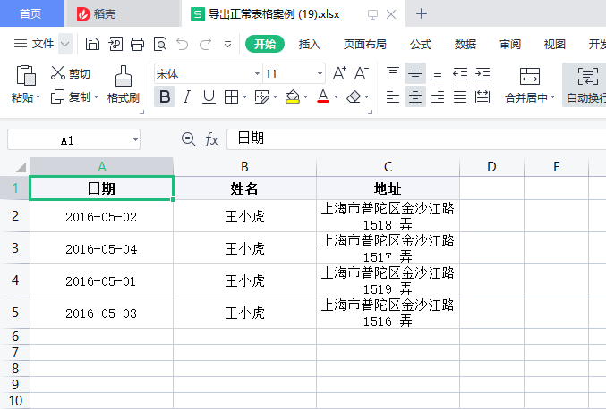
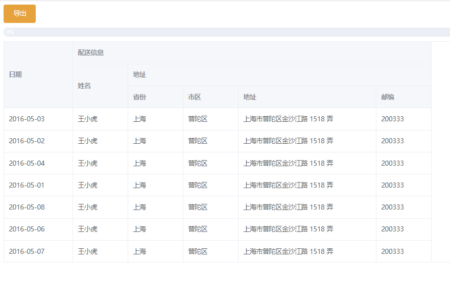
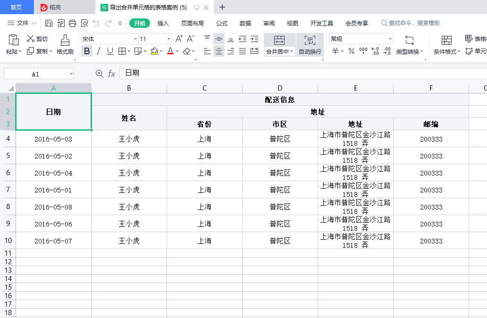

# Table-Exporter

> 使用前端 **table** 结构, 导出 **excel** 结构

## 1. 导出正常表格到Excel

 

   

```js
# code
// 点击导出触发的函数
handleExport() {
      const instance = new ElMapExportTable(
        { column, data },
        { progress: progress => console.log(progress) }// 进度条回调 
      );
      instance.download("导出正常表格案例");
}

# column
const column = [
        { title: "日期", dataIndex: "date" }, // title为excel列名称,dataIndex为当前列对应的数据源字段
        { title: "姓名", dataIndex: "name" },
        { title: "地址", dataIndex: "address" },
];

# data
const data = [
    	{
          date: "2016-05-02",
          name: "王小虎",
          address: "上海市普陀区金沙江路 1518 弄",
        },
        {
          date: "2016-05-04",
          name: "王小虎",
          address: "上海市普陀区金沙江路 1517 弄",
        },
        {
          date: "2016-05-01",
          name: "王小虎",
          address: "上海市普陀区金沙江路 1519 弄",
        },
        {
          date: "2016-05-03",
          name: "王小虎",
          address: "上海市普陀区金沙江路 1516 弄",
        },
]
```

## 2. 导出表头合并到Excel

 

 

```js
# code
// 点击导出触发的函数
handleExport() {
      const instance = new ElMapExportTable(
        { column, data },
        { progress: progress => console.log(progress) }// 进度条回调 
      );
      instance.download("导出合并单元格的表格案例");
}

# column
// 如果是合并单元格的列,设置成相应的树形结构即可
const column = [
    { title: "日期", dataIndex: "date" },
    {
        title: "配送信息",
        children: [
            { title: "姓名", dataIndex: "name" },
            {
                title: "地址",
                children: [
                    { title: "省份", dataIndex: "province" },
                    { title: "市区", dataIndex: "city" },
                    { title: "地址", dataIndex: "address" },
                    { title: "邮编", dataIndex: "zip" },
                ],
            },
        ],
    },
];

# data
const data = [
        {
          date: "2016-05-03",
          name: "王小虎",
          province: "上海",
          city: "普陀区",
          address: "上海市普陀区金沙江路 1518 弄",
          zip: 200333,
        },
        {
          date: "2016-05-02",
          name: "王小虎",
          province: "上海",
          city: "普陀区",
          address: "上海市普陀区金沙江路 1518 弄",
          zip: 200333,
        },
        {
          date: "2016-05-04",
          name: "王小虎",
          province: "上海",
          city: "普陀区",
          address: "上海市普陀区金沙江路 1518 弄",
          zip: 200333,
        },
        {
          date: "2016-05-01",
          name: "王小虎",
          province: "上海",
          city: "普陀区",
          address: "上海市普陀区金沙江路 1518 弄",
          zip: 200333,
        },
        {
          date: "2016-05-08",
          name: "王小虎",
          province: "上海",
          city: "普陀区",
          address: "上海市普陀区金沙江路 1518 弄",
          zip: 200333,
        },
        {
          date: "2016-05-06",
          name: "王小虎",
          province: "上海",
          city: "普陀区",
          address: "上海市普陀区金沙江路 1518 弄",
          zip: 200333,
        },
        {
          date: "2016-05-07",
          name: "王小虎",
          province: "上海",
          city: "普陀区",
          address: "上海市普陀区金沙江路 1518 弄",
          zip: 200333,
        },
]
```

## 3. 导出表体合并到Excel

## 4. 导出混合合并到Excel


## 5. 导出图片到Excel


## 6. 设置Excel的列样式


## 7. 设置Excel的行样式


## 8. 设置Execl的单元格样式


## 9. 设置Excel单元格格式


## 10. 设置Excel-Sheet样式


## 11. 导出多个Sheet到Excel


## 12. 临时插入Excel数据


## 13. 导出表尾统计到Excel


## 14. 导出大数据量表格到Excel


## 参数说明

### 1. STableExporter配置

| 参数    | 说明                             | 类型            | 默认值 |
| ------- | -------------------------------- | --------------- | ------ |
| process | 导出进度的回调函数               | function(value) | -      |
| tables  | 所有表格的数据集(具体配置见下表) | array           | []     |

### 2. table配置

| 参数             | 说明                                                         | 类型   | 默认值 |
| ---------------- | ------------------------------------------------------------ | ------ | ------ |
| headerData       | 头部数据(具体配置见下表)                                     | object | {}     |
| mainData         | 身体数据(具体配置见下表)                                     | object | {}     |
| footerData       | 表尾数据(具体配置见下表)                                     | object | {}     |
| insertHeaderData | 要插入的头部数据(具体配置见下表)                             | object | {}     |
| options          | 当前的工作表配置(参考 **exceljs** ),可以在这里设置固定列、固定行 | object | {}     |

### 3. data配置

| 参数            | 说明                                                         | 类型   | 默认值 |
| --------------- | ------------------------------------------------------------ | ------ | ------ |
| cells           | 单元格信息(具体配置见下表)                                   | array  | []     |
| columnStyle     | 列样式集合(参考 **exceljs** )                                | array  | []     |
| rowStyle        | 行样式集合(参考 **exceljs** )                                | array  | []     |
| rowLength(必填) | 所有行的总长度( **row** + **rowspan** )                      | number |        |
| options         | **excel** -当前 **sheet** 配置(参考 **exceljs** ),可以在这里处理固定列、固定行 | object | {}     |

### 4. cell配置

| 参数    | 说明                                                         | 类型   | 默认值 |
| ------- | ------------------------------------------------------------ | ------ | ------ |
| row     | 当前单元格在第几行(从 **0** 开始)                            | number | -      |
| col     | 当前单元格在第几列(从 **0** 开始)                            | number | -      |
| rowspan | 当前单元格向右合并多少个单元格(包括自己)                     | number | 1      |
| colspan | 当前单元格向下合并多少个单元格(包括自己)                     | number | 1      |
| text    | 当前单元格中的内容(这里的 **text** 会显示在对应的 **excel** 的单元格中) | any    | ''     |
| format  | 当前单元格对应的excel单元格格式                              | -      | -      |

## 5. 建议

- 在封装辅助函数期间,因为业务原因,只考虑用虚拟表格来实现业务功能，所以如果此包搭配**虚拟表格**使用效果是最佳的，不必额外遍历
- 如果使用的是其他**表格，诸如 element-ui、ant-vue...**类似的表格,也可以使用辅助函数来完成效果，但是增加了一些为了导出而造成额外遍历处理数据的操作,尽管也不需要额外的逻辑,但是多了一部分的代码
- 建议：如果使用的是**element-ui...等表格**,可以封装一个出自己的**辅助函数**,在**表格渲染前**将数据流向**辅助函数**,然后通过**辅助函数去渲染表格**,这样在集成**导出功能时直接将收集的信息交给导出即可**

