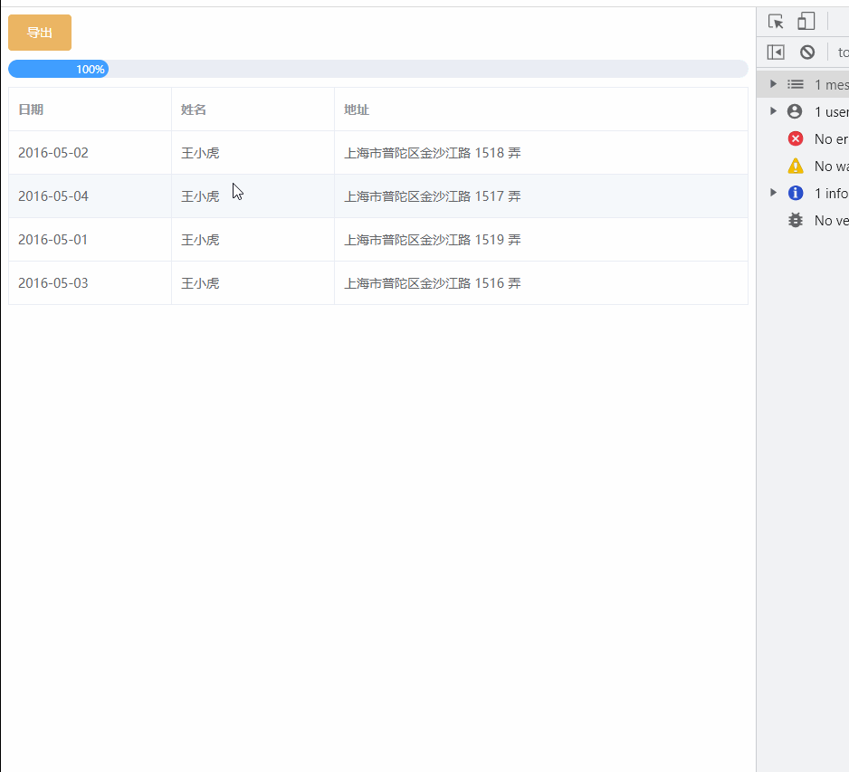
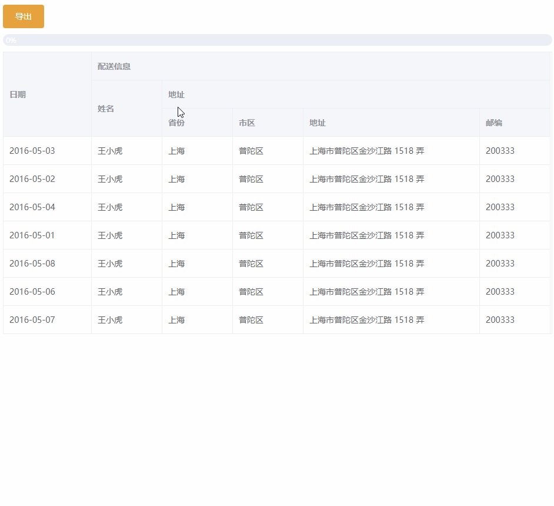

# Table-Exporter

> 使用前端 **table** 结构, 导出 **excel** 结构

## 1. 快速上手


## 1. 导出正常表格案例

 

```js
# coding
import { STableExporter } from 'STableExporter'
const exportInstance = new STableExporter({
      progress: this.progress, // 导出进度
      tables: [table] // table具体配置看下方代码
    });
await exportInstance.init(); // 初始化需要导出的数据
exportInstance.export(); // 需要导出的数据进行整合
exportInstance.download('导出正常表格案例'); // 导出excel

# table配置
一个 table 为一个 sheet,如果要导出多个 sheet，传递多个 table 即可
{	
    // 默认导出后的表格sheet名称，默认是 sheet + 索引
    "sheetName":"sheet",
    // 表格头部 -> excel头部
    "headerData": {
        // 必填---单元格信息
        "cells": [
            {
                // row/col/rowspan/colspan用来确定一个单元格位置
                "row": 0,
                "col": 0,
                "rowspan": 1,
                "colspan": 1,
                
                // 单元格文本内容
                "text": "日期",
                // 单元格样式,更多样式请参考 exceljs
                "style": {
                    "bold": true // 字体加粗
                }
            },
        ],
        // 选填---列样式,具体参数请参考 exceljs
        "columnStyle": [
            {
                "width": 20 // 列宽度
            },
        ],
        // 选填---行样式,具体参数请参考 exceljs
        "rowStyle": [
            {
                "height": 20 // 行高
            }
        ],
        // 必填---所有的行长度(row + rowspan)
        "rowLength": 1
    },
    // 表格身体 ---> excel内容区(同上)
    "mainData": {
        "cells": [
            {
                "row": 0,
                "col": 0,
                "rowspan": 1,
                "colspan": 1,
                "text": "2016-05-02"
            },
        ],
        "rowStyle": [
            {
                "height": 20
            },
        ],
        "rowLength": 4
    },
    // 针对当前excel-sheet的配置,更多配置请参考 exceljs
    "options": {
        // 设置第一行冻结(固定行)
        "views": [
            {
                "state": "frozen",
                "xSplit": 0,
                "ySplit": 1 
            }
        ]
    }
} 
```

### 完整示例代码

```js
# coding
// 导出功能.vue文件
 handleExport() {
      const control = new Control({
        data: this.tableData,
        progress: this.handlePercentage,
      });
      control.export();
 }

// .js文件
import { STableExporter } from '../../components/excel-download'
import { mapCreateTable } from '../../components/table-helpers/helpers'
import { createArray } from '../../components/excel-download/util'
export default class Control {
  constructor(options) {
    this.progress = options.progress
    this.data = options.data
  }
  export () {
    const headerData = this.handleExcelHeader()
    const mainData = this.handleExcelMain()
    const table = {
      headerData,
      mainData,
      // excel表格配置(非必填)
      options: {
        views: [{ state: 'frozen', xSplit: 0, ySplit: 1 }] // 冻结第一行
      }
    }
    console.log(table, 'table')
    this.download(table)
  }
  handleExcelHeader () {
    // 可以写死列配置，如果是动态列配置，请用辅助函数
    const cells = [
      { row: 0, col: 0, rowspan: 1, colspan: 1, text: '日期', style: { bold: true } }, // excel单元格样式
      { row: 0, col: 1, rowspan: 1, colspan: 1, text: '姓名', style: { bold: true } },
      { row: 0, col: 2, rowspan: 1, colspan: 1, text: '地址', style: { bold: true } },
    ]
    // excel列样式(非必填))
    const columnStyle = createArray(cells.length, (index) => {
      return index === cells.length - 1 ? { width: 40 } : { width: 20 }
    })
    // excel行样式(非必填)
    const rowStyle = [{ height: 20 }]
    // 总共有多少行(row + rowspan)
    const rowLength = 1
    return {
      cells,
      columnStyle,
      rowStyle,
      rowLength,
    }
  }

  handleExcelMain () {
    const defaultRow = { date: '日期', name: '姓名', address: '地址' };
    const columnList = Object.keys(defaultRow)
    const {
      mergeCells,
      excel: {
        rowStyle
      },
      data
    } = mapCreateTable({
      data: {
        rowList: this.data,
        columnList
      },
      mapCreateColumn: ({ columnLen }) => {
        return createArray(columnLen, index => {
          return {
            field: `${index}-field`,
          }
        })
      },
      mapCreateData: ({ row, column, columnIndex }) => {
        const key = `${columnIndex}-field`
        const value = row[column]
        return {
          key,
          value,
          excel: {
            text: value,
            height: 20
          }
        }
      }
    })

    return {
      cells: mergeCells,
      rowStyle,
      rowLength: data.length
    }
  }

  async download (table) {
    const exportInstance = new STableExporter({
      progress: this.progress,
      tables: [table]
    });
    await exportInstance.init();
    exportInstance.export();
    exportInstance.download('导出正常表格案例');
  }
}

```

## 2. 导出合并单元格的表格案例

   

### 完整实例代码

```js
# coding
// 导出功能.vue文件
 handleExport() {
      const control = new Control({
        data: this.tableData,
        progress: this.handlePercentage,
      });
      control.export();
 }

// .js文件
import { STableExporter } from '../../components/excel-download'
import { mapCreateTable, mapCreateMergeHeaderTable } from '../../components/table-helpers/helpers'
import { createArray } from '../../components/excel-download/util'
export default class Control {
  constructor(options) {
    this.progress = options.progress
    this.data = options.data
  }
  export () {
    const headerData = this.handleExcelHeader()
    const mainData = this.handleExcelMain()
    const table = {
      headerData,
      mainData,
      // excel表格配置(非必填)
      options: {
        views: [{ state: 'frozen', xSplit: 0, ySplit: 3 }] // 冻结前3行
      }
    }
    this.download(table)
  }
  handleExcelHeader () {
    // 如果想导出复杂表格,将数据整理成树形结构，交给辅助函数即可
    const treeData = [
      { name: '日期' },
      {
        name: '配送信息', children: [
          { name: '姓名' },
          {
            name: '地址', children: [
              { name: '省份' },
              { name: '市区' },
              { name: '地址' },
              { name: '邮编' }
            ]
          }
        ]
      }
    ]
    const result = mapCreateMergeHeaderTable({
      data: treeData,
      mapCreateColumn: ({ columnLen }) => {
        return createArray(columnLen, index => {
          return {
            field: `${index}-field`,
            excel: {
              width: index === 4 ? 30 : 20
            }
          }
        })
      },
      mapCreateData: ({ data, columnIndex }) => {
        const key = `${columnIndex}-field`
        const value = data.name
        return {
          key,
          value,
          excel: {
            text: value,
            font: {
              bold: true // 字体加粗
            },
            height: 20
          }
        }
      }
    })
    const { mergeCells, data, excel: { rowStyle, columnStyle } } = result
    return {
      cells: mergeCells,
      rowLength: data.length,
      rowStyle,
      columnStyle
    }
  }

  handleExcelMain () {
    const columnList = ['date', 'name', 'province', 'city', 'address', 'zip']
    const {
      mergeCells,
      excel: {
        rowStyle
      },
      data
    } = mapCreateTable({
      data: {
        rowList: this.data,
        columnList
      },
      mapCreateColumn: ({ columnLen }) => {
        return createArray(columnLen, index => {
          return {
            field: `${index}-field`,
          }
        })
      },
      mapCreateData: ({ row, column, columnIndex }) => {
        const key = `${columnIndex}-field`
        const value = row[column]
        return {
          key,
          value,
          excel: {
            text: value,
            height: 20
          }
        }
      }
    })

    return {
      cells: mergeCells,
      rowStyle,
      rowLength: data.length
    }
  }

  async download (table) {
    const exportInstance = new STableExporter({
      progress: this.progress,
      tables: [table]
    });
    await exportInstance.init();
    exportInstance.export();
    exportInstance.download('导出合并单元格的表格案例');
  }
}

```

## 3. 导出多个表格分成多个sheet案例

## 4. 导出插入表头额外数据案例


## 参数说明

### 1. STableExporter配置

| 参数    | 说明                             | 类型            | 默认值 |
| ------- | -------------------------------- | --------------- | ------ |
| process | 导出进度的回调函数               | function(value) | -      |
| tables  | 所有表格的数据集(具体配置见下表) | array           | []     |

### 2. table配置

| 参数             | 说明                                                         | 类型   | 默认值 |
| ---------------- | ------------------------------------------------------------ | ------ | ------ |
| headerData       | 头部数据(具体配置见下表)                                     | object | {}     |
| mainData         | 身体数据(具体配置见下表)                                     | object | {}     |
| footerData       | 表尾数据(具体配置见下表)                                     | object | {}     |
| insertHeaderData | 要插入的头部数据(具体配置见下表)                             | object | {}     |
| options          | 当前的工作表配置(参考 **exceljs** ),可以在这里设置固定列、固定行 | object | {}     |

### 3. data配置

| 参数            | 说明                                                         | 类型   | 默认值 |
| --------------- | ------------------------------------------------------------ | ------ | ------ |
| cells           | 单元格信息(具体配置见下表)                                   | array  | []     |
| columnStyle     | 列样式集合(参考 **exceljs** )                                | array  | []     |
| rowStyle        | 行样式集合(参考 **exceljs** )                                | array  | []     |
| rowLength(必填) | 所有行的总长度( **row** + **rowspan** )                      | number |        |
| options         | **excel** -当前 **sheet** 配置(参考 **exceljs** ),可以在这里处理固定列、固定行 | object | {}     |

### 4. cell配置

| 参数    | 说明                                                         | 类型   | 默认值 |
| ------- | ------------------------------------------------------------ | ------ | ------ |
| row     | 当前单元格在第几行(从 **0** 开始)                            | number | -      |
| col     | 当前单元格在第几列(从 **0** 开始)                            | number | -      |
| rowspan | 当前单元格向右合并多少个单元格(包括自己)                     | number | 1      |
| colspan | 当前单元格向下合并多少个单元格(包括自己)                     | number | 1      |
| text    | 当前单元格中的内容(这里的 **text** 会显示在对应的 **excel** 的单元格中) | any    | ''     |
| format  | 当前单元格对应的excel单元格格式                              | -      | -      |

## 5. 建议

- 在封装辅助函数期间,因为业务原因,只考虑用虚拟表格来实现业务功能，所以如果此包搭配**虚拟表格**使用效果是最佳的，不必额外遍历
- 如果使用的是其他**表格，诸如 element-ui、ant-vue...**类似的表格,也可以使用辅助函数来完成效果，但是增加了一些为了导出而造成额外遍历处理数据的操作,尽管也不需要额外的逻辑,但是多了一部分的代码
- 建议：如果使用的是**element-ui...等表格**,可以封装一个出自己的**辅助函数**,在**表格渲染前**将数据流向**辅助函数**,然后通过**辅助函数去渲染表格**,这样在集成**导出功能时直接将收集的信息交给导出即可**

